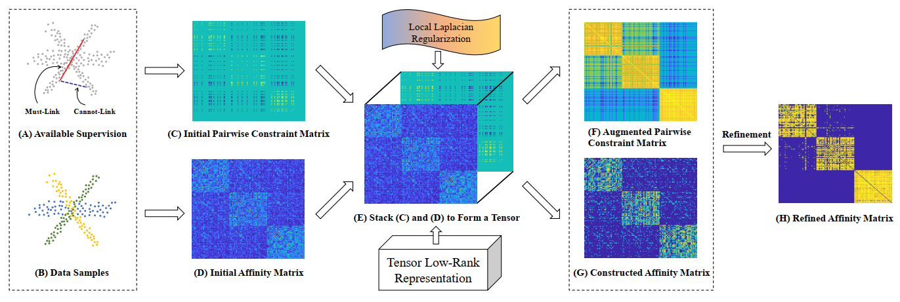

# Subspace-Clustering
The implementation of our paper *Semi-Supervised Subspace Clustering via Tensor Low-Rank Representation*
https://arxiv.org/abs/2205.10481

This repository contains:

1. [Datasets and Selected Annotations](data) in our paper, includeing ORL, YaleB, COIL20, Isolet, MNIST, Alphabet, BF0502 and Notting-Hill.
2. A [comparision demo](demo_parallel.m) of the mentioned methods (you may need to implement them yourself) in our manuscript, including LRR, DPLRR, SSLRR, L-RPCA, CP-SSC, SC-LRR and CLRR.
3. A [function](tlrr_tnn_new.m) to implement the proposed method.
4. Some raw experimental [results](result).
5. A [visualization demo](Visualization_demo_parallel.m) of the result files.

## Usage

Before running the code, you need to download the following toolbox:
1. LibADMM library from: https://github.com/canyilu/LibADMM
2. Graph Signal Processing Toolbox (GSPBox) from: https://github.com/epfl-lts2/gspbox
3. Clustering Measure from: https://github.com/jyh-learning/MVSC-TLRR

## Citation

If you find the code useful, please feel free to cite our paper:

@article{lu2022semi,
  title={Semi-Supervised Subspace Clustering via Tensor Low-Rank Representation},
  author={Lu, Guanxing and Jia, Yuheng and Hou, Junhui},
  journal={arXiv preprint arXiv:2205.10481},
  year={2022}
}

## Contact

Any questions, please contact me through guanxing AT seu DOT edu DOT cn
